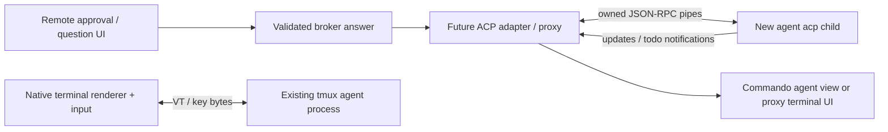

# Cursor ACP feasibility spike

The installed Cursor CLI successfully initialized a new ACP stdio child with
protocol v1. This establishes transport feasibility. It does **not** establish
remote approval/question/todo parity for Commando's existing interactive tmux
processes. There is no documented live-process attachment mechanism in the
sources reviewed. `session/load` resumes a conversation through an ACP connection;
it does not prove ownership of an already-running terminal process.

This is an executable, opt-in, initialize-only spike, with no production adapter
or transcript reader. Observation dates: 2026-10-06–07 (Europe/London). Codex thread:
`01a1136d-3ca6-7be2-ade4-0d2b21cf984a`.

## Reproduce

From this worktree, with the existing Node/dependencies and an installed `agent`:

```sh
node scripts/cursor-acp-spike.mjs
node scripts/cursor-acp-spike.mjs --live --timeout-ms 10000
npm test -- scripts/cursor-acp-spike.test.ts
npm run typecheck
```

The default prints help and launches nothing. `--agent /absolute/path/to/agent`
selects an executable; it is passed to `spawn` without a shell. The script is also
executable as `./scripts/cursor-acp-spike.mjs --live`. No dependency/config changes
are required. Fake peers run via Node and require neither Cursor nor network/auth.

The live command runs `agent --version`, then `agent acp`, writes exactly one
client request (`initialize`, ID `0`), and closes the child. It advertises no client
file access or client terminal execution. The deadline covers version and
initialize together, configurable from 100 to 30000 ms. Cleanup sends SIGTERM,
escalates after 250 ms to SIGKILL if needed, and waits for the owned child's exit
before removing its temporary directories. SIGINT/SIGTERM in the probe trigger
the same cleanup. An external SIGKILL of the probe cannot run JavaScript cleanup.
Cleanup waits for actual exit observation; it cannot impose a hard time limit on
an OS refusing to reap a killed process.

Each run creates a private temporary workspace, HOME, config/cache/data/tmp paths
and empty project/home `.cursor/mcp.json` files. Child environment construction is
an allowlist; inherited API keys, auth tokens, Commando/tmux variables, proxy
settings and `NODE_OPTIONS` are excluded. Only PATH is inherited to resolve/run
the installed executable. This limits incidental profile/MCP loading; it is not
an OS filesystem or network sandbox for the installed CLI. The spike itself does
not read credential files, authenticate, check account status, create/load a
session, or send a model prompt. CLI-internal telemetry/network/profile behavior
was not instrumented. The inspected installed launcher uses `exec` for its Node
runtime; cleanup targets only the direct child, not shared processes or a broad
process group. A custom `--agent` wrapper must likewise own/replace its child;
arbitrary daemonizing wrappers are outside this spike's cleanup guarantee.

Stderr is discarded, not forwarded. The report excludes agent names/titles,
arbitrary metadata, method names, payload text, paths, error bodies and unknown
auth IDs. It reports known capability booleans/presence and the fixed
`cursor_login` ID only. This prevents output leaks without attempting heuristic
credential redaction. Unknown metadata is deliberately omitted, so this is not a
complete capability dump. Input is bounded to 64 KiB per line and 1 MiB total.

## Actual local evidence

Default command exited `0`:

```text
Cursor ACP initialize-only spike (no subprocess unless --live)
Usage: node scripts/cursor-acp-spike.mjs --live [--timeout-ms 10000] [--agent /path/to/agent]
Timeout: 100–30000 ms across version + initialize, plus owned-child cleanup.
Uses disposable HOME/config/workspace; inherited credentials are excluded.
Never authenticates, creates/loads a session, prompts a model, or approves a request.
```

`node scripts/cursor-acp-spike.mjs --live --timeout-ms 10000` exited `0`, with
this actual sanitized JSON (not fixture output):

```json
{
  "status": "initialized",
  "installedVersion": "2026.10.01-e373342",
  "timeoutMs": 10000,
  "isolationRemoved": true,
  "versionCleanup": {
    "exitObserved": true,
    "forcedKill": false,
    "code": 0,
    "signal": null
  },
  "advertised": {
    "protocolVersion": 1,
    "agentCapabilities": {
      "loadSession": true,
      "promptCapabilities.image": true,
      "promptCapabilities.audio": false,
      "promptCapabilities.embeddedContext": false,
      "mcpCapabilities.http": true,
      "mcpCapabilities.sse": true,
      "sessionCapabilities.list": true
    },
    "authMethodIds": [
      "cursor_login"
    ],
    "unreportedAuthMethodCount": 0,
    "agentInfoReported": false,
    "unrecognizedMetadataOmitted": true
  },
  "counters": {
    "requestsCancelled": 0,
    "requestsUnsupported": 0,
    "unmatchedResponses": 0,
    "notifications": {}
  },
  "cleanup": {
    "exitObserved": true,
    "forcedKill": false,
    "code": 143,
    "signal": null
  }
}
```

Exit code `143` belongs to the ACP child during intentional cleanup; the probe
itself succeeded. No live permission, question, plan, todo, task, or update was
received. Authentication state is **unknown**: no auth/status command was run.
Initialize working without an authentication request says nothing about later
session/model access. Session listing/loading and MCP connectivity were not called.

Fixture verification output:

```text
> commando@0.1.0 test
> vitest run scripts/cursor-acp-spike.test.ts

Test Files  1 passed (1)
     Tests  16 passed (16)
```

The suite spawns a real deterministic NDJSON peer, records client messages and
child PIDs, and verifies:

- Strict correlation for numeric `0`, string `"0"`, and `"client:init"`; a
  method-bearing server request with the client's pending ID remains a request.
  A response with the wrong ID/type does not complete initialize.
- Permission/question/plan requests receive cancelled outcomes, including when
  the only supplied permission option grants permanent access. No option is
  selected, no plan accepted, and no question answered.
- Notifications receive no reply, including blocking-method names without IDs.
  Unknown requests, client file/terminal requests, and an unexpected `cursor/task`
  request receive fixed `-32601` errors. No arbitrary payload or method enters the
  report. Notification bodies are counted/discarded, not mapped into todos.
- Chunked framing; safe RPC-error, invalid JSON, oversized frame, early-exit and
  unsupported-version failures; metadata/version/stderr filtering and excluded
  inherited credentials.
- Initialize/version deadline and AbortSignal cancellation, SIGTERM resistance,
  forced SIGKILL, exit observation, PID disappearance and temporary path removal.
  Tests also cover executable spawn failure and default CLI opt-in behavior.

`npm run typecheck` exited `2` in concurrently added, out-of-scope code:

```text
scripts/install-show-in-commando-skill.test.ts(37,66): error TS7053: Element implicitly has an 'any' type because expression of type 'string' can't be used to index type '{ HOME: string; }'.
  No index signature with a parameter of type 'string' was found on type '{ HOME: string; }'.
scripts/install-show-in-commando-skill.test.ts(38,33): error TS2339: Property 'CLAUDE_CONFIG_DIR' does not exist on type '{ HOME: string; }'.
```

The spike test file also passed this isolated strict TypeScript check (exit `0`,
no output), without altering any project configuration:

```sh
node node_modules/typescript/bin/tsc --ignoreConfig --noEmit --strict --skipLibCheck --module NodeNext --moduleResolution NodeNext --target ES2022 --types node scripts/cursor-acp-spike.test.ts
```

The initial invocation without `--ignoreConfig` returned TS5112; adding the flag
required by the installed compiler resolved that invocation error. Both `.mjs`
files passed `node --check` (exit `0`, no output). No unrelated fixes,
full-suite run, service start/restart, commit, merge, dependency change, login or
CLI install/update was performed. Concurrent edits and `.redline/cursor-cli-support.html`
were preserved.

### Independent parent verification

Recorded **2026-10-07 00:03:07 Europe/London (2026-10-06 23:03:07 UTC)**
from the parent's reported independent rerun; this follow-up did not rerun checks.
The parent observed identical default help and live
`node scripts/cursor-acp-spike.mjs --live --timeout-ms 10000` output: initialized
ACP v1, version `2026.10.01-e373342`, the same advertised capabilities and cleanup
results shown above. All **16 targeted fixture tests passed**. Both `.mjs`
`node --check` commands, the isolated strict TypeScript command above, and
`test -x scripts/cursor-acp-spike.mjs` passed.

The parent's latest `npm run typecheck` failed in concurrent, out-of-scope code:

```text
server/push-notifier.test.ts(359,68): error TS2345: Argument of type '{ sessionId: string; sessionName: string; }' is not assignable to parameter of type 'AgentStatusKind | undefined'.
server/push-notifier.test.ts(360,255): error TS2345: Argument of type '{ sessionId: string; sessionName: string; }' is not assignable to parameter of type 'AgentStatusKind | undefined'.
```

This is a separate later observation; the original typecheck errors above remain
as historical evidence. No concurrent code was fixed by this documentation update.
The rerun adds no evidence for authentication, sessions, live extensions or control
of the existing tmux process.

## Evidence matrix

“Advertised” means a field in this local initialize response; it is not an
exercised operation. “Fixture-only” proves the probe's handling of synthetic
messages, not Cursor's behavior. “Documented-only” comes from official sources.

| Surface | Evidence | Integration consequence / gap |
| --- | --- | --- |
| ACP stdio NDJSON / initialize v1 | **Live exercised**; child exited and isolation removed | A Commando-owned child transport is feasible. |
| Image prompts, HTTP/SSE MCP | **Advertised true**, not exercised | Requires session/auth and policy testing before use. |
| Audio / embedded context | **Advertised false** | Cannot claim these prompt inputs for this version. |
| `session/load`, session listing | **Advertised**, not exercised | Conversation resume/listing does not establish attachment to a live tmux process. |
| `cursor_login` | **Advertised**; authentication **unknown** | Do not infer account access or initiate login from the probe. |
| `session/new`, prompt/update/cancel; agent/plan/ask modes | **Documented-only** | No live session, model turn, mode change or prompt cancellation was tested. |
| `session/request_permission` | **Documented-only**; cancellation reply **fixture-only** | A future adapter must translate a validated broker action to an option actually supplied by this request. |
| `cursor/ask_question` | **Documented-only**; cancellation reply **fixture-only** | Preserve question/option IDs; multi-select is documented. Free-text answers have no documented field. |
| `cursor/create_plan` | **Documented-only**; cancellation reply **fixture-only** | Blocking acceptance requires a plan-specific UI/model and explicit user choice. |
| `cursor/update_todos` | **Documented-only**; notification silence/counting **fixture-only** | Future adapter needs per-session merge/replacement semantics; the spike does not implement todo state. |
| `cursor/task`, `cursor/generate_image` | **Documented-only**; envelope handling **fixture-only** | Notifications are observations, not a generic task-control API. |
| Remote answers to the exact existing interactive CLI process | **Unknown / architectural gap** | No documented attachment endpoint or live proof; do not promise full remote parity. |
| Native terminal rendering | Existing local code inspected, not UI-tested by this spike | Rendering/keypress support does not confer ACP stdin/stdout ownership. |

## Documented wire shapes and limits

The following extension facts come from the full official Cursor ACP excerpt
supplied for this task (already collected through ctx7), checked against the
[official ACP page](https://cursor.com/docs/cli/acp). The ctx7 commands were not
repeated. This spike does not solicit a model turn to manufacture extension
evidence.

These documented interfaces describe the request `params` and response `result`
inside JSON-RPC envelopes; the question response retains its nested `outcome`
object. Question and option IDs are distinct from JSON-RPC request IDs.

```ts
interface CursorAskQuestionRequest {
  toolCallId: string;
  title?: string;
  questions: Array<{
    id: string;
    prompt: string;
    options: Array<{ id: string; label: string }>;
    allowMultiple?: boolean;
  }>;
}

interface CursorAskQuestionResponse {
  outcome:
    | {
        outcome: "answered";
        answers: Array<{
          questionId: string;
          selectedOptionIds: string[];
        }>;
      }
    | { outcome: "skipped"; reason?: string }
    | { outcome: "cancelled" };
}

interface CursorUpdateTodosRequest {
  toolCallId: string;
  todos: Array<{
    id: string;
    content: string;
    status: "pending" | "in_progress" | "completed" | "cancelled";
  }>;
  merge: boolean;
}
```

| Message | Documented fields and outcomes | Adapter requirement |
| --- | --- | --- |
| `session/request_permission` request | Options carry `optionId` and permission kind; selected result carries that supplied ID; cancellation carries `outcome: cancelled` | Never hardcode a grant ID; hide unsupported always grants and cancel on disconnect/expiry. See [ACP tool-call permissions](https://agentclientprotocol.com/protocol/v1/tool-calls). |
| `cursor/ask_question` request | `toolCallId`, optional title, `questions[{id,prompt,options[{id,label}],allowMultiple?}]`; result is answered with `answers[{questionId,selectedOptionIds}]`, skipped, or cancelled | Validate IDs and cardinality against the pending request. Labels alone are ambiguous; duplicate labels must not silently pick an option. No documented free-text field. |
| `cursor/create_plan` request | `toolCallId`, optional name/overview, markdown `plan`, `todos[{id,content,status}]`, optional `isProject`/phases; accepted with optional `planUri`, rejected, or cancelled | Model plan acceptance separately from ordinary questions/tool permissions. |
| `cursor/update_todos` notification | `toolCallId`, todos with `pending/in_progress/completed/cancelled`, `merge` boolean | Merge by stable todo ID when true; replace the whole list when false. Namespace by connection/session and clear on ownership changes. |
| `cursor/task` notification | `toolCallId`, description/prompt, `subagentType` enum or custom object; optional model/agentId/durationMs | Subagent observation does not imply arbitrary user task creation, modification or execution RPC. |
| `cursor/generate_image` notification | `toolCallId`, description, optional output/reference paths | Displaying an observation must not turn suggested paths into file access or execution. |

Cursor's page calls todo/task/image messages notifications while also showing
response interfaces. That is a documentation inconsistency, not evidence of a
new command API. The JSON-RPC envelope decides whether a reply is required: no
`id` means notification; `method` plus an ID means server request. The spike
returns cancellation for the three known blocking methods and a fixed unsupported
error for other requests, including notification methods unexpectedly carrying
IDs. Its cancellation is a **request response**, not a `session/cancel` command.

## Grounding in Commando

These file:line references describe the concurrently edited worktree inspected
during the spike; those edits are owned by other work. The spike changes none of
this code.

- [server/tmux-create.ts:285](../server/tmux-create.ts#L285) creates an independent
  tmux session/shell command. [server/index.ts:1616](../server/index.ts#L1616) routes
  input to tmux; [server/tmux.ts:249](../server/tmux.ts#L249) delegates bytes to the
  controller, whose [send-keys encoding at server/tmux-control.ts:285](../server/tmux-control.ts#L285)
  injects terminal bytes. These paths carry terminal input, not ACP response IDs.
- [server/agent-interaction-broker.ts:14](../server/agent-interaction-broker.ts#L14)
  validates permission action/question array shapes; its
  [wait/answer path at line 71](../server/agent-interaction-broker.ts#L71) keys by
  pane/request and resolves on timeout or consumer loss. It does not validate
  Cursor option membership or `allowMultiple` constraints.
- [server/agent-status-api.ts:256](../server/agent-status-api.ts#L256) holds an HTTP
  hook reply while a broker request is pending.
  [server/agent-request-answers.ts:70](../server/agent-request-answers.ts#L70) releases
  it through the shared answer path; an ACP adapter would instead retain the
  relevant child connection and JSON-RPC request ID.
- [shared/protocol.ts:64](../shared/protocol.ts#L64) represents questions using
  labels and `custom`/`multiple`, with answers as `string[][]`. Cursor requires
  explicit question and option IDs; a future adapter must retain those and must
  disable custom/free-text answers unless new evidence supplies a supported field.
- The native Cursor hook path being added at
  [server/cursor-hooks.ts:107](../server/cursor-hooks.ts#L107) emits a neutral
  permission/continue response **before** telemetry HTTP I/O. Its normalized
  events do not supply question/todo requests; the inspected
  [registry at server/agent-status-registry.ts:1174](../server/agent-status-registry.ts#L1174)
  stores empty pending-request/task maps. This is not a remote answer transport.
  Native hook permission shapes do not prove question answering or persistent
  always grants; those remain gaps, regardless of ACP's advertised capabilities.
- [server/agent-status-registry.ts:536](../server/agent-status-registry.ts#L536)
  bounds/normalizes todo snapshots, then replaces its map. ACP's merge=true
  notifications require an accumulated per-session map before applying an
  equivalent snapshot. The
  [session-brief parser at server/session-brief-api.ts:113](../server/session-brief-api.ts#L113)
  and [generated helper at server/agent-hook-installer.ts:710](../server/agent-hook-installer.ts#L710)
  have no generic user tasks input. Existing status tasks are observations, not
  a task mutation API.
- [Swift native terminal send at AppMain.swift:317](../spikes/native-terminal/swift/Sources/NativeTerminalSwiftSpike/AppMain.swift#L317)
  emits input bytes; [UI routing at main.tsx:169](../spikes/native-terminal/ui/main.tsx#L169)
  forwards them to the selected pane. A real native terminal backend handles VT
  output and keypresses; it does not by itself acquire the agent's JSON-RPC pipes.

## Recommended production direction and remaining work

Keep existing interactive sessions terminal-owned. Treat any future ACP feature
as an explicit **ACP-owned launch/proxy architecture**: Commando (or a local
proxy) starts one `agent acp` process and owns its stdin/stdout from launch,
with a mapping between connection, process, session, turn, UI target and pending
RPC ID. Remote broker answers must return to that exact connection. This is an
architectural recommendation inferred from the documented transport and inspected
code, not a production implementation or demonstrated terminal attach.



ACP stdout is protocol output, not the interactive CLI's TUI. Preserving a terminal
experience would require a separate client/proxy that renders updates and collects
input, or a dedicated agent view alongside ordinary terminal panes. A terminal
renderer can host that proxy, but cannot simply display raw ACP stdout and gain
the existing interactive Cursor UX. ACP client `terminal` capability concerns
agent tool subprocess execution, not terminal rendering or existing-process
attachment. The spike deliberately advertises it false.

Before production work, separately verify auth/session creation/loading/listing,
live permission option IDs and grant persistence, question cardinality/IDs,
plan acceptance, todo merge/replacement, prompt cancel and reconnect/expiry.
Scope all replies to the original process/session/turn, preserve protocol ID types,
reject stale answers, cancel on consumer loss, and avoid duplicate delivery if
hooks and ACP report related events. Explicitly design plan approvals and todo
state lifecycle. None of these mappings were integration-tested here.

Loading the same conversation in a second ACP process could fork/concurrently
operate on that history; its effects on a live terminal conversation are unknown.
A future same-process claim needs a documented attachment mechanism and a test
where a remote answer demonstrably unblocks the exact original tmux CLI process.
Do not use session IDs, resume commands or initialize capability flags as that
proof. No such experiment was performed and this spike does not change ownership
of an active session.

No sandbox/network/auth gate blocked initialize. The broad typecheck failure is
recorded above and left to its owner. If a later probe is gated, keep its safe
failure status and mark live evidence unknown; do not bypass the sandbox, login,
install/update the CLI, start shared services, or send a cloud prompt to obtain it.
Stop for scope expansion/design-changing ambiguity or two repeats of the same
underlying verification failure; offline fixture evidence remains distinct from
live behavior.

Official references checked:

- [Cursor CLI ACP](https://cursor.com/docs/cli/acp): transport, extensions,
  sessions, modes, MCP scope and integration instructions. Team/dashboard MCP is
  documented unsupported in ACP; no project/user MCP server was exercised here.
- [ACP initialization](https://agentclientprotocol.com/protocol/v1/initialization):
  version/capability negotiation and client terminal/file capability meaning.
- [ACP session setup](https://agentclientprotocol.com/protocol/v1/session-setup):
  session creation/loading through an initialized connection.
- [ACP tool calls and permissions](https://agentclientprotocol.com/protocol/v1/tool-calls):
  supplied option IDs and cancelled outcomes.

The optional Cursor CLI reference and standalone ACP permissions URLs returned
tool fetch errors; conclusions above use the successful ACP/initialization/session
setup/tool-call pages and supplied official source excerpt, not those failed fetches.
